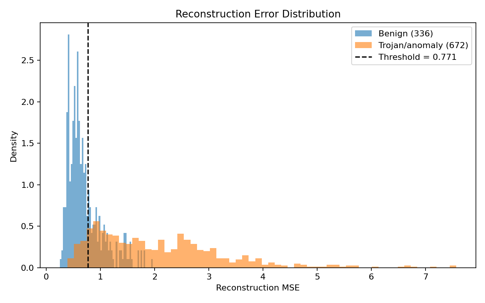
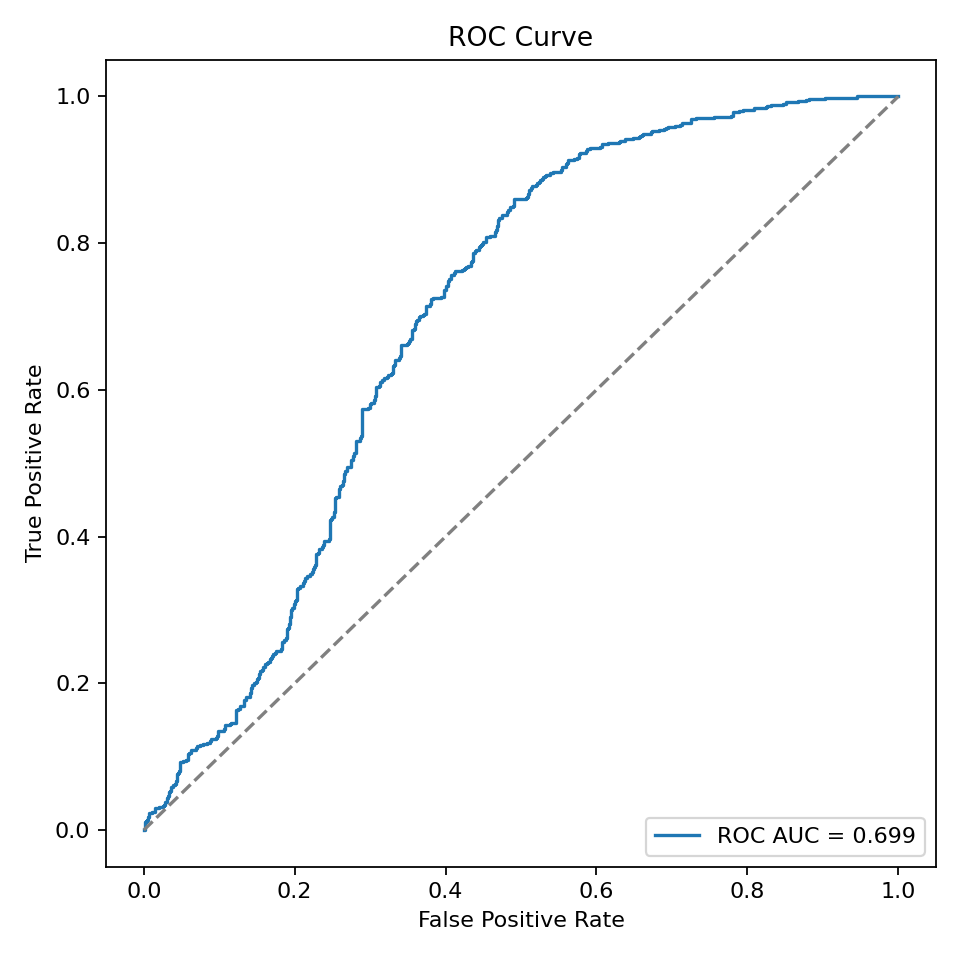
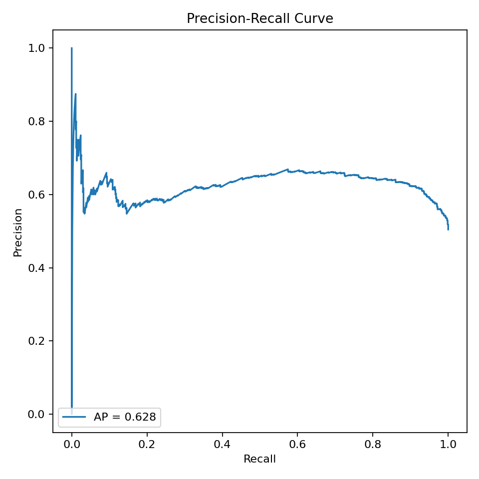

# Final Report — Hybrid Static–Dynamic Security Framework (HSDSF)

**Project:** Hybrid Static–Dynamic Security Framework for supply‑chain anomaly detection (Jetson-class target)  
**Date:** 2025‑12‑21  

## 1) Executive Summary

This project delivers a minimum viable hybrid security pipeline that combines:

- **Static, off-device binary inspection** using LLM-assisted analysis over disassembly/metadata.
- **Dynamic, on-device-style behavioral fingerprinting** using time-series telemetry (perf counters + thermal signals) to detect “Trojan-like” runtime behavior.

**Key outcomes (implemented + validated):**

- **Phase 2 (Static LLM analysis):** Implemented `phase2/analyze_binary.py`, built clean/trojan ELF binaries, and demonstrated strong separation between clean and trojan samples.
  - Clean vs Trojan average risk score separation: **0.17 vs 0.69** (≈4×)
  - Trojan: **8 high‑risk functions** (>0.7) vs Clean: **0** high‑risk functions
- **Phase 3 (Telemetry collection + workloads):** Implemented an experiment harness that generates labeled runs with ground-truth Trojan activation intervals.
  - Dataset in repo: **12 runs**, **7,233 samples**, **10 Hz**, covering idle, normal, and 3 trojan variants.
- **Phase 4 (Anomaly model training):** Implemented an **LSTM autoencoder** anomaly detector trained on benign telemetry windows and evaluated on held-out runs.
  - Example evaluation (trojan-vs-normal): **AUC 0.884**, Trojan precision **0.931**, Trojan recall **0.897**
  - Exported artifacts suitable for TensorRT conversion: `model.onnx`, plus `scaler.pkl`, `threshold.json`, and `features.json`.

## 2) Scope, Assumptions, and Threat Model

### Scope
- **In-scope**: Binary static analysis (ELF), telemetry capture, labeled dataset creation, anomaly model training, export to ONNX for downstream TensorRT deployment.
- **Out-of-scope**: Production hardening, large-scale dataset coverage, adversarial robustness proof, full secure boot / supply-chain attestation.

### Threat model (PoC)
- A supply-chain attacker modifies firmware/binaries to introduce:
  - **Static indicators**: suspicious authentication bypass, environment-variable backdoors, anti-debug logic, hardware fingerprinting.
  - **Dynamic indicators**: periodic hidden compute/memory/I/O bursts inconsistent with known-good workloads.

## 3) System Architecture

### 3.1 Static analysis (Phase 2)
Inputs:
- ELF binary
- Extracted artifacts: `objdump` disassembly, `strings`, `nm`, `readelf`, `file`

Processing:
- Chunk by function headers in disassembly
- LLM scoring and structured findings (risk score + evidence)

Outputs:
- `extraction_summary.json`
- `function_reports.json`
- `binary_report.md`

### 3.2 Dynamic telemetry & dataset (Phase 3)
Inputs:
- Workload mode: `idle`, `normal`, `trojan_*`
- Data sources:
  - `perf` events (cycles, instructions, IPC, cache/branch, context switches, page faults)
  - thermal sensors via `/sys`
  - `tegrastats` (when available)

Processing:
- Time alignment to **10 Hz** (dt = 0.1s)
- Zero-order hold alignment across sources
- Optional trojan interval logging (`trojan_intervals.csv`)

Outputs per run directory:
- `telemetry.csv`
- `meta.json`
- `trojan_intervals.csv` (trojan runs)

### 3.3 Anomaly model (Phase 4)
Model:
- **LSTM autoencoder** trained on benign windows to minimize reconstruction MSE

Inference:
- Window the telemetry stream (e.g., 5–10s windows)
- Normalize using saved scaler
- Compute reconstruction error
- Flag anomaly if error exceeds threshold (percentile-based)

Artifacts:
- `model.pt` and `model.onnx`
- `scaler.pkl`, `features.json`, `threshold.json`
- `metrics.json`

## 4) Phase-by-Phase Implementation and Results

## 4.1 Phase 1 — Setup & Threat Model
- Established the phased PoC plan in `README.md`.
- Implemented a repo structure with phase-specific runbooks.

## 4.2 Phase 2 — Static LLM-Based Firmware/Binary Analysis

### What was built
- End-to-end runner: `phase2/analyze_binary.py`
  - Extraction: disassembly + strings + symbols + metadata
  - Chunking: function-level chunks (fallback when stripped)
  - LLM calls: Cerebras model integration
  - Reporting: per-function JSON + executive markdown

### Synthetic binaries + ground truth
- `phase2/firmware_clean.c` / `phase2/firmware_trojan.c`
- Ground truth backdoors documented in `phase2/ground_truth.md`:
  - Backdoor credentials: `debug` / `letmein!`
  - Env var bypass: `FW_DEBUG_KEY=0xDEADBEEF`

### Results (from `phase2/RESULTS.md`)
- Trojan avg risk: **0.69** (max **0.90**, **8** functions > 0.7)
- Clean avg risk: **0.17** (max **0.60**, **0** functions > 0.7)

Interpretation:
- The static pipeline differentiates clean vs trojan binaries and highlights suspicious patterns in/around the authentication logic.

## 4.3 Phase 3 — Telemetry Collection & Labeled Dataset

### What was built
- Unified telemetry collector + parsers: `phase3/scripts/collect_telemetry.py`, `perf_reader.py`, `sys_sensors.py`, `tegrastats_reader.py`
- Orchestrator: `phase3/scripts/run_experiment.py`
- Workloads:
  - Benign: `phase3/scripts/run_normal_workload.py`
  - Trojans: `phase3/scripts/run_trojan_workload.py` (compute, memory, I/O variants)
- Validator: `phase3/scripts/validate_dataset.py`

### Dataset summary
- **12 runs**: 3× idle, 3× normal, 2× each trojan variant (compute/memory/I/O)
- **Sampling**: 10 Hz
- **Trojan schedule**: 10s period, 2s active (≈20% duty)
- **Platform**: NVIDIA Jetson AGX Xavier
- **Collection environment**: JetPack-enabled Jetson with perf counters, thermal sensors, and tegrastats

## 4.4 Phase 4 — Anomaly Model Training & Export

### What was built
- Training script: `phase4/train_anomaly.py`
  - Sliding window creation
  - StandardScaler fit on benign-only samples
  - Run-level split (reduces leakage)
  - Trojan-only evaluation mode
  - ONNX export support

### Example evaluation result (user-run; trojan-vs-normal)
Configuration (typical):
- Windowed time-series input (10 Hz)
- Autoencoder trained on benign windows
- Threshold chosen as **95th percentile** of benign reconstruction error

Reported metrics:
- AUC: **0.8839**
- Trojan precision: **0.9306**
- Trojan recall: **0.8973**
- Normal recall: **0.5982** (false positives are still present; threshold tuning recommended)

Interpretation:
- For a PoC, this is a strong baseline: it reliably detects the majority of trojan windows.
- False-positive rate can be reduced by increasing the percentile threshold (e.g., 97.5) or by using longer windows.

### Evaluation plots

The following plots can be generated from the saved Phase 4 artifacts to visually validate separability:

- Reconstruction error distribution (normal vs trojan): 
- ROC curve: 
- Precision–Recall curve: 

To generate them:

```bash
python phase4/plot_evaluation.py --artifacts-dir phase4/artifacts
```

## 5) How to Reproduce

### Phase 2 (static)
- Build sample binaries: `gcc -static -O2 -s phase2/firmware_clean.c -o phase2/firmware_clean` (and trojan)
- Run analysis:
  - Extraction only: `python phase2/analyze_binary.py phase2/firmware_trojan --skip-llm`
  - Full LLM: `python phase2/analyze_binary.py phase2/firmware_trojan --max-functions 20 --batch-size 8`

### Phase 3 (telemetry)
- Run a single experiment:
  - `python phase3/scripts/run_experiment.py --label normal --duration 60`
  - `python phase3/scripts/run_experiment.py --label trojan_compute --trojan-variant compute --duration 60`

### Phase 4 (training)
- Train (recommended trojan-vs-normal evaluation):
  - `python phase4/train_anomaly.py --runs-dir phase3/data/runs --output-dir phase4/artifacts --device cuda --export-onnx --anomaly-mode trojan --train-labels normal --benign-eval-labels normal --threshold-percentile 95`

## 6) Deployment Plan (TensorRT on Jetson)

To complete the Phase 4 deployment loop on Jetson:

1. Copy Phase 4 artifacts to Jetson:
   - `model.onnx`, `scaler.pkl`, `features.json`, `threshold.json`
2. Convert ONNX → TensorRT engine:
   - Example: `trtexec --onnx=model.onnx --saveEngine=model.plan`
3. Implement a real-time monitor process:
   - Collect live telemetry at 10 Hz (reuse Phase 3 collectors)
   - Maintain sliding windows
   - Normalize with `scaler.pkl`
   - Inference with TensorRT
   - Emit anomaly scores + alert when exceeding threshold

## 7) Limitations and Risks

- **Dataset scale**: 12 runs × 60s from Jetson hardware is a reasonable PoC baseline; production deployment benefits from larger temporal coverage.
- **Synthetic trojans**: compute/memory/I/O patterns are realistic proxies but not full malware.
- **Thresholding**: percentile thresholds trade false positives vs missed detections; deployment needs tuning.

## 8) Recommendations / Next Steps

1. Collect a larger dataset on the Jetson hardware (multiple sessions/days, varying ambient temp, different power modes).
2. Validate features across different nvpmodel/jetson_clocks configurations.
3. Add evaluation plots:
   - reconstruction error distribution (normal vs trojan)
   - ROC curve / PR curve
4. Build the Jetson `rt_monitor.py` loop (Phase 4.3) and validate end-to-end latency.

---

## Appendix A — Repository Map

- Phase 2 static analysis: `phase2/`
- Phase 3 telemetry + workloads: `phase3/`
- Phase 4 training + export: `phase4/`
- Overall plan: `README.md`
